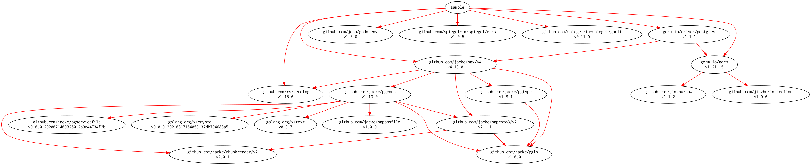

# [gorm-sample] -- 「PostgreSQL と ORM と Logging と」サンプルコード（gorm.io/gorm 編）

[](https://raw.githubusercontent.com/spiegel-im-spiegel/gorm-sample/master/LICENSE)

このリポジトリは拙文「[PostgreSQL と ORM と Logging と](https://zenn.dev/spiegel/books/a-study-in-postgresql)」の説明用サンプルコードとして公開したものです。

以下のようにモジュール名を `sample` としているためそのままインポートして使うことは出来ません。あしからずご了承ください。

```
module sample

go 1.17

require (
    github.com/jackc/pgx/v4 v4.13.0
    github.com/joho/godotenv v1.3.0
    github.com/lib/pq v1.10.3
    github.com/rs/zerolog v1.15.0
    github.com/spiegel-im-spiegel/errs v1.0.5
    github.com/spiegel-im-spiegel/gocli v0.11.0
    gorm.io/driver/postgres v1.1.1
    gorm.io/gorm v1.21.15
)

require (
    github.com/jackc/chunkreader/v2 v2.0.1 // indirect
    github.com/jackc/pgconn v1.10.0 // indirect
    github.com/jackc/pgio v1.0.0 // indirect
    github.com/jackc/pgpassfile v1.0.0 // indirect
    github.com/jackc/pgproto3/v2 v2.1.1 // indirect
    github.com/jackc/pgservicefile v0.0.0-20200714003250-2b9c44734f2b // indirect
    github.com/jackc/pgtype v1.8.1 // indirect
    github.com/jackc/puddle v1.1.3 // indirect
    github.com/jinzhu/inflection v1.0.0 // indirect
    github.com/jinzhu/now v1.1.2 // indirect
    golang.org/x/crypto v0.0.0-20210817164053-32db794688a5 // indirect
    golang.org/x/text v0.3.7 // indirect
)
```

[MIT ライセンス](./LICENSE)で公開しているので，ライセンス条件に従ってサンプルコードを複製・配布・改変することは自由です。

## Modules Requirement Graph

[](./dependency.png)

[gorm-sample]: https://github.com/spiegel-im-spiegel/gorm-sample "spiegel-im-spiegel/gorm-sample: 「PostgreSQL と ORM と Logging と」サンプルコード（gorm.io/gorm 編）"
